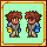

# Asymmetric Equips



Ever wanted to wear just one eyepatch? Well now you can!

Certain items can now be worn asymmetrically, which is noted in their tooltips. Simply hold shift and control, then click the item.
Note that this can only be done when the item is equipped or in the player's inventory.

[Download the mod on Steam!](https://steamcommunity.com/sharedfiles/filedetails/?id=2878558240)

## Mod Calls

| Call | Description | Example
| --- | --- | --- |
| `"AddEquip", EquipType equipType, int equipId, int newId = -1, int side = 2 : void` | **This method must be called before recipes are added.**<br/>Registers a single equip slot to behave asymmetrically.<br/><br/>`equipType` and `equipId` are the same parameters input into `EquipLoader.GetEquipTexture()`.<br/><br/>`newId` is what id to replace the equip with. This defaults to `-1`, which removes the equip. This is useful for items like the Molten Skull Rose: The player shouldn't stop wearing the skull when turned around, but they should lose the rose.<br/><br/>`side` is which side of the player this equips appears on when the player is facing right. For 99% of equips, this is 2 (Right). HandsOff equips use 1 (Left). If your equip has both HandsOn and HandsOff, consider using `AddGlove` instead.| `mod.Call("AddEquip", EquipType.HandsOn, ArmorIDs.HandOn.BandofRegeneration);`<br/><br/>`mod.Call("AddEquip", EquipType.Face, ArmorIDs.Face.MoltenSkullRose, ArmorIDs.Face.LavaSkull, 1);` | 
| `"AddGlove", int itemId : void` | **This method must be called before recipes are added.**<br/>A shortcut for adding gloves.<br/><br/>`itemId` is the type of the glove item. **This item *must* have both a `HandsOn` and `HandsOff` equip slot.** | `mod.Call("AddGlove", ItemID.TitanGlove);` |
| `"AddSpecialItem", int itemId : void` | **This method must be called before recipes are added.**<br/>Marks an item as asymmetric, but doesn't do anything with it. Intended for items like Yoraiz0r's Spell, which have non-equip slot visual effects.<br/>**You must manually handle asymmetricism for special items using `ItemOnFrontSide`.**<br/><br/>`itemId` is the type of the item you'd like to mark. | `mod.Call("AddSpecialItem", ItemID.Yoraiz0rWings);` |
| `"ItemOnFrontSide", Item item, Player player : bool` | Checks if a given equip is on the player's front (camera-facing) side. Returns `true` if so, or if the item in question isn't asymmetric at all. | <pre>// In a ModItem's UpdateAccessory() method<br/>if (asymmetricEquips.Call("ItemOnFrontSide", Item, player))<br/>{<br/>	player.GetModPlayer\<CoolPlayer\>().coolItemVisuallyEquipped = true;<br/>}</pre> |

It is recommended to make a helper method if you plan on adding several special items to your mod:
```cs
internal static bool ItemOnFrontSide(Item item, Player player)
{
	return !ModLoader.TryGetMod("AsymmetricEquips", out Mod mod) || mod.Call("ItemOnFrontSide", item, player);
}
```
